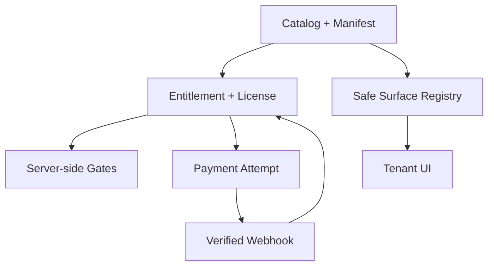

# معيار تطوير وتشغيل إضافات أودير v3

هذا الملف هو العقد الإلزامي لأي إضافة جديدة. لا تُنشر إضافة بمجرد ظهور زرها في الواجهة؛ النشر يعني اكتمال عقد البيانات، بوابات الوصول، الصور الحقيقية، العزل، الدفع إن وُجد، واختبارات الرجوع الآمن.

## 1. قواعد لا تقبل الاستثناء

1. الإضافة لا تملك بيانات منشأة أخرى ولا تستعلم دون `tenant_id` موثّق من الخادم.
2. إيقاف الإضافة أو انتهاء ترخيصها يمنع الوصول والكتابة الجديدة فقط. لا يحذف بيانات التشغيل.
3. كل سعر نسخة مؤرخة. لا يُكتب فوق السعر التاريخي.
4. كل ترخيص له بداية ونهاية واضحتان، والحالة الفعلية تُحسب في الخادم لا في المتصفح.
5. كل شاشة أو قائمة أو تقرير أو مهمة خلفية لها `surface_key` معروف ومسجل.
6. قاعدة البيانات لا ترسل اسم Component قابلًا للتنفيذ أو Route حرًا إلى الواجهة.
7. أسرار الدفع والتكاملات في Supabase Vault فقط، ولا تعود في Snapshot أو Log.
8. `configured` لا تعني `active`. التفعيل يحتاج اختبار Adapter وWebhook حقيقيًا.
9. كل Mutation قابلة للتكرار بأمان أو تملك Idempotency Key.
10. لا Production migration ولا تفعيل لريـف قبل اجتياز Staging وCanary وخطة Rollback.

## 2. طبقات النواة



- `catalog.addon_products`: هوية المنتج التجارية الثابتة.
- `catalog.addon_manifests`: عقد إصدار Versioned للإضافة.
- `catalog.addon_surfaces`: مواضع الظهور المعلنة.
- `catalog.addon_media`: الصور والفيديو والمساعدة.
- `catalog.addon_price_versions`: سجل السعر السنوي.
- `catalog.tenant_addon_subscriptions`: ترخيص المنشأة.
- `catalog.tenant_addon_subscription_events`: سجل دورة الحياة غير القابل للمحو.
- `marketplace.payment_provider_configs`: إعداد عام غير سري.
- `marketplace.payment_provider_secret_refs`: UUID إلى Vault فقط.

## 3. مفتاح وهوية الإضافة

اختر `product_key` مرة واحدة بصيغة `snake_case`، مثل:

```text
inventory_forecast
```

واختر `feature_key` Namespace واضحًا:

```text
addon.analytics.inventory_forecast
```

لا تعِد استخدام مفتاح إضافة محذوفة، ولا تغيّر المفتاح بعد وجود تراخيص أو أحداث. تغيير الاسم الظاهر مسموح داخل Manifest جديد.

## 4. Manifest الإلزامي

كل إصدار يستخدم SemVer ويحتوي على الأقل على:

```json
{
  "manifestVersion": "1.0.0",
  "contractVersion": 3,
  "shortDescription": "وصف واضح في سطر واحد",
  "longDescription": "ماذا تفعل الإضافة وما حدودها",
  "installMode": "entitlement",
  "dataPolicy": "preserve_on_disable",
  "dependencies": [],
  "requiredPermissions": ["tenant.settings.manage"],
  "configurationSchema": {
    "type": "object",
    "additionalProperties": false
  },
  "releaseNotes": "التغيير الذي سيراه العميل"
}
```

قواعد النشر:

- المسودة قابلة للتعديل.
- النسخة المنشورة لا تُعدّل في مكانها؛ أنشئ نسخة جديدة.
- لا توجد إلا نسخة Current واحدة لكل منتج.
- Dependency يجب أن يكون منتجًا معروفًا وإصدارًا متوافقًا.
- Permission يجب أن تكون موجودة في كتالوج الصلاحيات قبل النشر.

## 5. سجل مواضع الظهور

لكل أثر في التطبيق سجل مستقل:

| النوع | مثال | Gate مطلوب |
|---|---|---|
| `navigation` | عنصر قائمة | Entitlement + Permission |
| `screen` | شاشة كاملة | Server page guard |
| `settings` | تبويب إعدادات | Manage permission |
| `dashboard_card` | بطاقة مؤشر | Snapshot filter |
| `report` | تقرير وتحليل | Read permission + tenant filter |
| `automation` | Rule/Job | Worker entitlement check |
| `api` | RPC/Endpoint | Auth + membership + entitlement |

استخدم مفتاحًا مثل:

```text
tenant.inventory.forecast
```

ثم سجله صراحةً في `lib/addons/placement-registry.js`. الواجهة تحل المفتاح إلى Route Compiled داخل الكود. ممنوع استخدام `routeTemplate` القادم من قاعدة البيانات مباشرة داخل `href` أو `import()`.

إذا لم يوجد مسار مسجل، تُعرض الإضافة باعتبارها تعمل في الخلفية ولا يظهر زر فتح وهمي.

## 6. الصور والمساعدة

قبل نشر إضافة جديدة يلزم ثلاث مواد حقيقية على الأقل:

1. Cover يشرح القيمة.
2. لقطة للشاشة الأساسية بعد التفعيل.
3. لقطة لإعدادات التحكم أو تقرير الإضافة.

المتطلبات:

- لا تستخدم Mockup على أنه شاشة حقيقية.
- اطمس أي بريد أو هاتف أو اسم عميل أو Token.
- اكتب `alt` عربيًا يصف ما يظهر.
- ارفع الملف إلى Bucket مخصص، وحد أقصى للصورة 8MB.
- لا تعرض `storage_path` مباشرة للمتصفح.
- استخدم مسار same-origin المصرح:

```text
/api/tenant/{slug}/addon-media/{productKey}/{mediaKey}
```

- تتحول Media إلى `active` فقط بعد وجود ملف صالح ومراجعته.
- خانات `draft` لا تظهر للمنشأة ولا تنتج صورًا مكسورة.

## 7. التسعير

السعر في `amount_minor`:

```text
900 SAR = 90000
```

كل تغيير يضيف صفًا جديدًا في `addon_price_versions` مع:

- `valid_from`
- `valid_to` بنطاق نصف مفتوح `[from, to)`
- `currency`
- `billing_interval = year`
- Tax metadata
- سبب التغيير

لا تعدّل Order قديمًا عند تغيير السعر. Order يحتفظ بـ`price_version_id` الذي اشتراه العميل.

## 8. حساب الترخيص

الحالة المعروضة ليست العمود وحده. تُحسب من:

- مصدر الاستحقاق.
- حالة Subscription.
- `period_start` و`period_end`.
- فترة التجربة.
- Explicit tenant override.
- `period_is_authoritative` عند الحاجة الانتقالية.

الترتيب العام Additive: Override ثم Plan ثم Subscription. الاستثناء المعلن فقط هو `period_is_authoritative=true`؛ وقتها الفترة المؤرخة تتقدم على الباقة القديمة مع بقاء Override الصريح أعلى أولوية.

كل Gate قديم يستدعي `private_app.tenant_addon_enabled` يستفيد تلقائيًا من فحص الانتهاء في v3.

## 9. Gate في كل نقطة دخول

يجب فحص الاستحقاق في جميع المستويات، وليس إخفاء الزر فقط:

- Server Component أو Layout.
- Route Handler.
- RPC أو Function.
- Queue consumer وCron job.
- Webhook side effect.
- Export أو Report.
- Realtime subscription إن وُجد.

النمط الصحيح:

```text
authenticate
→ resolve tenant membership
→ require user permission
→ require addon entitlement
→ validate tenant-scoped resource
→ execute
→ audit
```

## 10. سياسة البيانات

عند Pause أو Expiry أو Cancel:

- امنع إنشاء عمليات جديدة.
- أخفِ مواضع الظهور التشغيلية.
- احتفظ بالجداول والصفوف والملفات وسجل الأحداث.
- احتفظ بمعرفات Connections لكن أوقف الإرسال.
- اسمح بعرض تاريخي Read-only عندما يجيز المنتج ذلك.

ممنوع داخل Lifecycle action:

```sql
delete from operational_table;
truncate operational_table;
drop table operational_table;
```

حذف بيانات العميل عملية مستقلة لها سياسة Retention وموافقة وتدقيق، وليست نتيجة انتهاء إضافة.

## 11. وسائل الدفع

كل مزود ينفذ Adapter موحدًا:

```ts
interface PaymentProviderAdapter {
  createCheckout(input: BoundOrder): Promise<CheckoutSession>;
  verifyWebhook(request: RawWebhookRequest): Promise<VerifiedEvent>;
  fetchPayment(reference: string): Promise<ProviderPayment>;
  refund(input: BoundRefund): Promise<RefundResult>;
  healthCheck(): Promise<HealthResult>;
}
```

ويجب ربط الحدث الموثّق بـ:

- `payment_attempt_id`
- `order_id`
- `tenant_id`
- `provider_key`
- Merchant/account
- Amount minor
- Currency

النجاح في Return URL لا يفعّل الإضافة. التفعيل يأتي من Webhook موثّق أو Reconciliation موثّق.

الحالة:

```text
draft → configured → active
                 ↘ error
```

- `configured`: الأسرار المطلوبة موجودة فقط.
- `active`: Adapter وWebhook وMerchant binding نجحت فعليًا.
- أي Secret rotation يعيد الحالة إلى `configured` حتى إعادة الاختبار.

راجع `docs/payment-provider-security.md` للتفاصيل الخاصة بـTamara وPaymob وPayPal.

## 12. قواعد Migration

- DDL إضافي فقط في إصدار الميزة الأول.
- `BEGIN` و`COMMIT` مرة واحدة لكل ملف.
- Foreign Keys الحساسة `ON DELETE RESTRICT`.
- RLS مفعّل ويفضل Force RLS للجداول الداخلية.
- Direct grants مرفوضة؛ القراءة والكتابة من RPC مصرح.
- الفهارس تغطي Foreign Keys ومسارات `tenant_id + status + period_end`.
- Seed يستخدم `ON CONFLICT` آمنًا.
- لا تعتمد على UUID مولّد في بيئة أخرى؛ اربط بالمفاتيح الطبيعية.
- لا تغيّر أو تحذف عمودًا يستخدمه v2 في نفس الإصدار.

## 13. اختبارات إلزامية

### قاعدة البيانات

- Tenant A لا يرى ولا يعدّل Tenant B.
- Expired returns `enabled=false` و`status=expired`.
- Plan لا يهزم فترة Authoritative.
- Explicit override يبقى أعلى أولوية.
- تداخل فترات السعر مرفوض.
- Webhook replay لا يكرر التفعيل.
- Refund لا يحذف بيانات الإضافة.
- لا Snapshot يعيد Secret أو Vault UUID.
- Protected lifecycle يرفض التعديل قبل الموعد.

### التطبيق

- حالات Loading/Empty/Error/Forbidden.
- Keyboard وFocus trap وEscape في Dialog.
- كل Surface يحل من Registry فقط.
- لا يظهر زر Open إذا لا يوجد Placement.
- الصورة تمر من Media proxy وتحتاج جلسة وصلاحية.
- RTL وMobile وTimezone المنشأة.

### الدفع

- Signature صحيحة وخاطئة.
- Timestamp قديم وReplay.
- Amount/Currency/Merchant mismatch.
- Duplicate webhook بالتوازي.
- Out-of-order events.
- Partial/Full refund.
- Provider timeout وRecovery reconciliation.

## 14. مسار الإطلاق

1. وثّق Baseline: أعداد المنتجات والتراخيص والصفوف الحرجة.
2. خذ Backup قابلًا للاستعادة قبل نافذة Production.
3. طبق Migration على Staging.
4. شغّل Static tests وSQL probes وSupabase advisors.
5. اختبر منشأة Sandbox لا تحتوي بيانات حقيقية.
6. اختبر Preview على Staging فقط.
7. نفّذ Reef read-only smoke test قبل أي Mutation.
8. فعّل Feature flag لفريق المنصة أولًا.
9. Canary لمنشأة تجريبية واحدة.
10. راقب الأخطاء، فشل Webhooks، زمن RPC، وعدد Entitlements.
11. افتح للمنشآت تدريجيًا.

## 15. Rollback

Rollback الطبيعي لا يحذف Schema ولا بيانات:

- عطّل Navigation أو Feature flag.
- ضع Provider في `disabled` أو Adapter في Observe-only.
- أوقف إنشاء Checkout sessions الجديدة.
- اترك Webhooks تستقبل وتسجل Idempotently إن كان إيقافها يفقد أحداثًا.
- أعد التطبيق للإصدار السابق المتوافق مع v2.
- لا تحذف Subscription أو Event أو Operational data.

إذا كان الخلل في Migration، أنشئ Forward-fix additive. لا تستخدم `DROP` أو `DELETE` كحل سريع أثناء الحادث.

## 16. حماية ريف الحالية

عقد سنة الإطلاق:

```text
tenant: reef-skills
start:  2026-08-01 00:00:00 +03:00
end:    2027-08-01 00:00:00 +03:00
range:  [start, end)
```

- كل الـ15 إضافة Authoritative لهذه الفترة.
- Lifecycle مقفول حتى نهاية الفترة.
- أي تغيير قبلها يجب أن يكون Migration طوارئ مستقلًا، بسبب موثق، ومراجعة مزدوجة.
- البيانات التشغيلية لا تدخل في Migration الترخيص.

## 17. Definition of Done

لا تعتبر الإضافة جاهزة حتى تكون كل البنود صحيحة:

- [ ] Product وFeature keys ثابتان.
- [ ] Manifest منشور بإصدار SemVer.
- [ ] السعر السنوي مؤرخ.
- [ ] كل Surface مسجل في DB وفي Registry.
- [ ] ثلاث صور حقيقية مع Alt ولا تحتوي بيانات شخصية.
- [ ] جميع نقاط الدخول Server-gated.
- [ ] RLS وGrants وIndexes مراجعَة.
- [ ] Pause/Expiry لا يحذفان بيانات.
- [ ] اختبارات Tenant isolation ناجحة.
- [ ] الدفع Provider-native وIdempotent إن كان مدفوعًا.
- [ ] Staging وCanary وRollback موثقة.
- [ ] لا تحذير أمني جديد متعلق بالإضافة.
- [ ] موافقة تشغيلية قبل Production.
