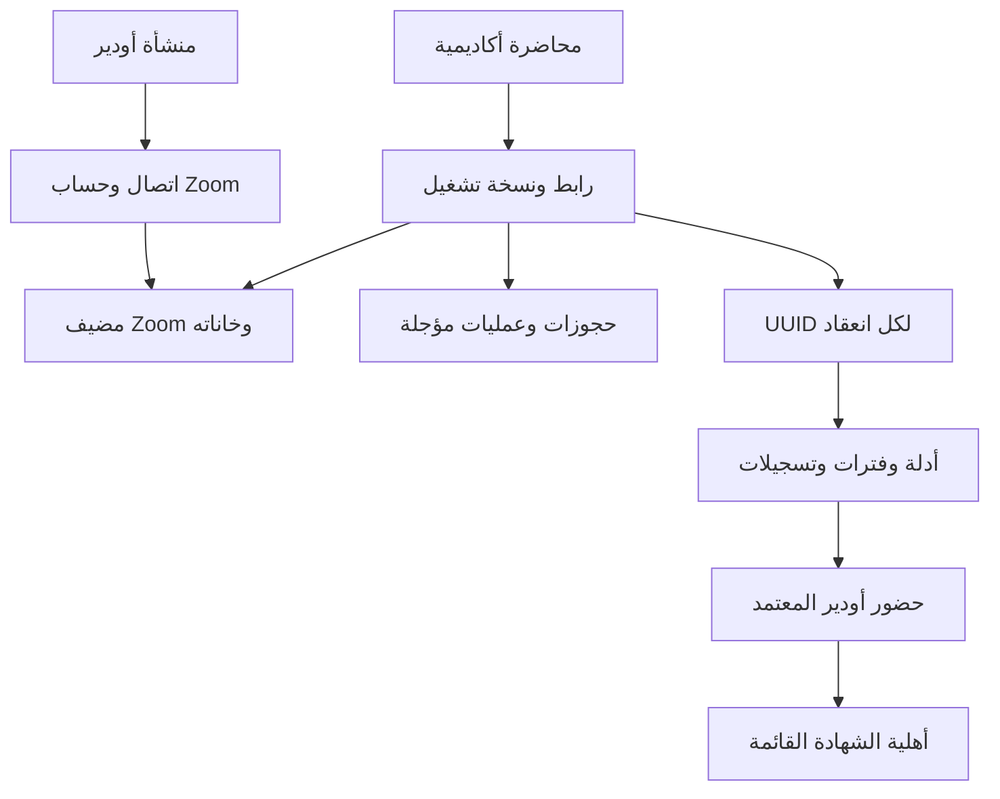

# التصميم والبيانات ومصادر الحقيقة

## السلطات القائمة

| المعلومة | السلطة المستخدمة | حد الإضافة |
|---|---|---|
| شخص/عميل ومصدر وإسناد | sales_core.contacts/contact_identities، قواعد الإسناد القائمة | الندوة تعيد استخدام الملف؛ لا تنشئ طالبًا مدفوعًا |
| تسجيل وقبول ودفعة | academy.students/enrollments/course_runs | Zoom لا يقبل طالبًا ولا يعكس إيصالًا |
| موعد ومدرب | academy.course_run_sessions/training_run_instructors | desired/observed في Zoom ليستا جدولًا أكاديميًا بديلًا |
| استحقاق مالي | private_app.training_journey_financial_access_v1 | السياسة الحالية تسمح للمقبول بالاستمرار بعد تأخر أقساط لاحقة؛ لا تُخترع قطيعة اليوم الثامن |
| هوية طالب/مدرب | training_learner_accounts، access_control، academy.platform_memberships ضمن تفعيلها القائم | لا صلاحية من role preview أو asHost المرسل من المتصفح |
| حضور معتمد وشهادة | attendance_records وخدمتا أهلية/إصدار الشهادة القائمتان | أدلة Zoom تدخل بقرار مراجعة، مع حارس ضد تجاوز المسار القديم |
| محتوى وتقييم | محرر academy.authoring القائم ومساراته | AI يضيف مسودة؛ النشر البشري وإتاحة LMS ونطاق ماركتون مستقلة |
| الرسائل والمهام | training_automation_jobs/dispatch، work_core.tasks | لا قناة إرسال ثانية ولا fallback مركزي للمنشآت الجديدة |
| الأسرار والتدقيق | Supabase Vault، write_audit | أسرار لكل اتصال لا تظهر في snapshots/الأحداث/التدقيق |
| التكلفة والذكاء | Odeiry run/budget/finalization ومصادر الاستخدام القائمة | لا تكلفة Zoom مختلقة ولا شراء تلقائي |

## العلاقات

الجداول الجديدة في `zoom_core` امتداد للمزود: settings/connections/oauth_attempts، hosts/host_instructors/busy_windows، links/reservations/commands/operations، events/instances/roster/registrations/access_grants/intervals/teaching_windows، recordings/recording_opens/retention_runs/purge_requests، AI drafts، webinar settings/registrations، replacements، resource_syncs/report_exports/report_chunks. لكل ارتباط منشأة روابط مركبة حيث يكون الطرف مملوكًا للمنشأة؛ لا منح قراءة مباشرة للمتصفح. تبقى IDs الأجنبية نصوصًا معتمة.

التنفيذ موزع على ترحيلات إضافية مولدة بـSupabase CLI من `20260922201432_zoom_accounts_resources_v1.sql` إلى أحدث ملف Zoom؛ لم تُعدَّل ترحيلات منشورة في الأساس. الجداول الجديدة لا تتطلب backfill عام. wrappers للدوال القائمة تحفظ تنفيذها السابق ثم تضيف شروط Zoom؛ الدوال الوسيطة غير ممنوحة للمستخدمين.

## الحساب والحجز

هوية الحساب+بيئة التطبيق فريدة عالميًا؛ الحساب المعاد تفويضه لا يضاعف المضيف. `add` و`reconnect` منفصلان. state مهشّم، أحادي الاستخدام، مرتبط بالفاعل وبعودة ثابتة. lease تجديد لكل اتصال وgeneration يمنعان عاملين من تدوير الرمز نفسه. فقد رد التجديد يطلب إعادة ربط، ولا يعيد استعمال refresh token قديم.

توزيع المضيف حتمي: الارتباط بالمدرب، التفضيل، الاستخدام النسبي للخانات، أقدم إسناد ثم ID. أهلية المزود والمدرب والدفعة والوقت والسعة شرط قبل اليدوي والتلقائي. النافذة نصف مفتوحة مع هامش 10 دقائق قابل للتعديل. أقفال قصيرة وحجز داخل المعاملة؛ طلب المزود خارجها. قدرات مجهولة لا تزيد السعة؛ الحد المحافظ واحد، وزيادة مؤكدة من Concurrent add-on محدودة بحد أدنى مثبت اثنين. اجتماع+ندوة أو ندوتان على مضيف واحد لا يسمح بهما حتى إن ثبتت خانتا اجتماعات.

النجاح الخارجي غير المؤكد يحفظ الحجز والعملية؛ لا إعادة إنشاء عمياء. تحديث المورد يحتفظ بالحجز السابق حتى إقرار المزود. الاستبدال عبر حسابين يحفظ المرجع القديم ويحرر حجزه بعد تأكيد الإلغاء. سلاسل محددة: 2–30 محاضرة، مضيف ومدرب ودفعة ومدة واحدة، انتظام يومي/أسبوعي بتوقيت المنشأة مع فحص DST؛ طلب إنشاء واحد ومطابقة جميع الوقائع ذريًا. السلسلة غير المنتظمة تُرفض كلها. تعديل وقعة يغير الوقت والمدة فقط كي لا يغير المضيف أو إعدادات بقية السلسلة صامتًا.

## دخول وأدلة

الخادم يعيد فحص التسجيل والهوية والمال والإسناد عند كل طلب حساس، وعند استهلاك grant مدته 45 ثانية. دخول الطالب يستخدم تسجيله الشخصي مع بريد موثق؛ لا بريد مصطنع. البدء يحصل على تفويض هوية المدرب نفسه، ولا يتشارك الطلاب ZAK مضيف. الحالة المعروضة للزر مشتقة من سلطة الدخول نفسها وتبقى استرشادية.

Webhooks تتحقق من الجسم الخام ثم تحفظ projection صغيرة قبل الإقرار. المعالجة تربط الحساب والوقعة/UUID؛ لا tenant من payload. إيقاف قديم لا ينهي إعادة تشغيل أحدث. تعديلات بلا UUID تطلق قراءة الاجتماع؛ التطابق لا يولد اختلافًا كاذبًا، والاختلاف لا يعتمد الموعد الخارجي. sweep يفحص الاجتماعات المقبلة خلال 72 ساعة كل 12 ساعة، والمنتهية خلال 30 يومًا كل 6 ساعات عند نقص الأدلة، ضمن ميزانية العامل.

الحضور = اتحاد فترات صحيحة ∩ نافذة معتمدة − الاستراحات، بالثواني. يُحفظ roster تاريخي قبل النقل/الانسحاب. لا خروج مختلق ولا غياب من تعطل المزود. manualSeconds/override منفصلان عن الدليل؛ المزامنة لا تمحوهما. وزن الدورة بمجموع الثواني، مع شروط المحتوى والتقييم والمال القائمة. نقص الساعات يمنع اكتمالًا زائفًا. تحديث دليل/قرار بعد شهادة صادرة ينشئ مهمة مراجعة، لا يمحو الشهادة. التداخل الفعلي للطالب ينشئ مهمة، لا اتهامًا أو خصمًا تلقائيًا.

## حدود الوسائط والتقارير

الاختيار الحالي رابط Zoom محكوم في Vault؛ لا نسخ فيديو إلى مخزن جديد، ولا رفع ملفات حي. يلزم نشر بشري وسياسة إتاحة. إعادة استحقاق عند استخراج الرابط؛ الرابط الأصلي الذي سبق كشفه له حدود إبطال المزود. القياس `opened_only`؛ لا منح إكمال من فتح الصفحة.

snapshot 50 صفًا وفترة 93 يومًا. تقارير كبيرة حتى 50 ألف محاضرة عبر jobs، 100 صف/دفعة، ticket دقيقتان مربوط بالمستخدم والمنشأة مع فحص الصلاحية في كل chunk؛ الناتج ساعة. CSV يحمي من الصيغ. مؤشرات التكلفة غير المتاحة null، ونسبة الحضور تخص السجلات المعتمدة مع عرض عدد المتوقع والمعتمد. ليست نقرات الملفات ساعات مشاهدة، وليست الندوات إيرادًا.
